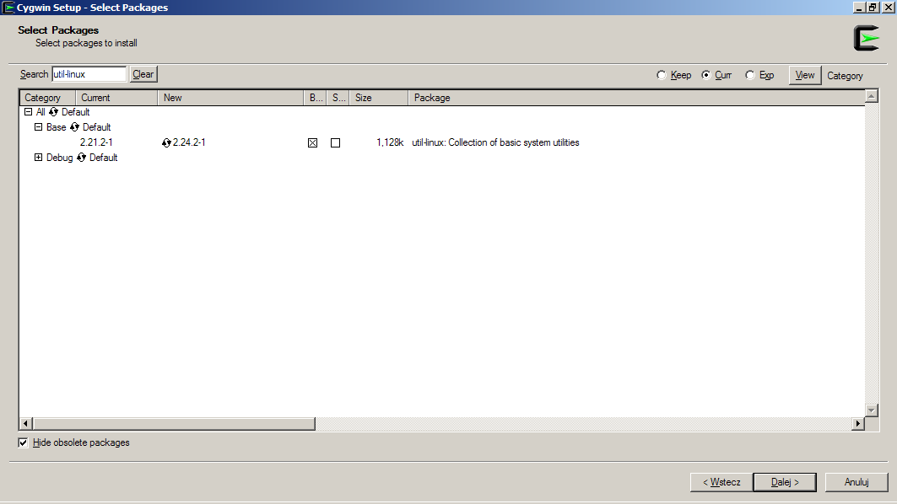
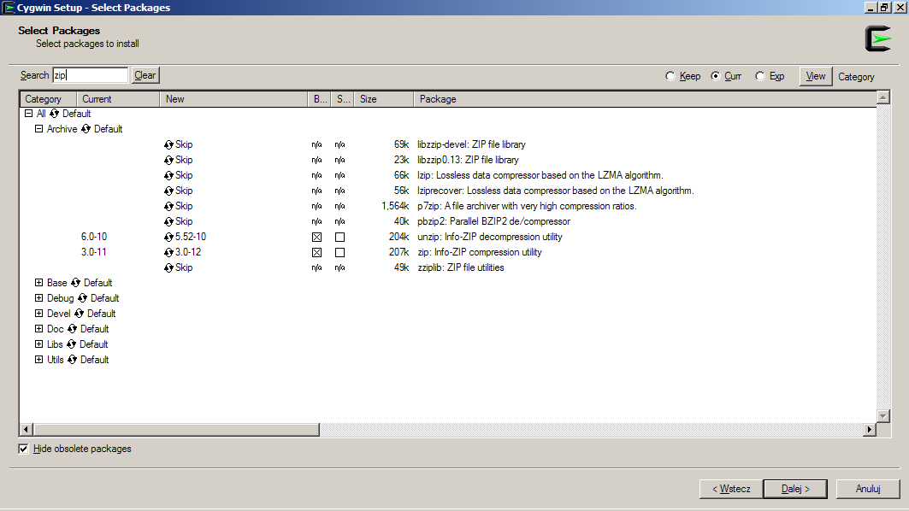

CQ-Unix-Toolkit
===============

Table of contents
-----------------

1. Introduction
2. Which for what? (quick description for each tool)
3. Supported shell environments
4. Notes on Cygwin compatibility
5. CQ Compatibilty
6. Installation
7. Building an RPM package
8. Contributors

Introduction
------------

CQ Unix Toolkit is a set of POSIX shell tools that calls curl and other 3rd
party commands to perform some different tasks on Adobe CQ platform such as:

* Create, build, rewrite, upload, list, download, install and deletion of CRX
  zip packages
* Maintenance tasks: consistency checks, TarPM compaction and index merge,
  DataStore garbage collection
* Clear/invalidate dispatcher cache for subtree specified by `/statfilelevel`
* Active workflow instances list
* Display OSGI bundles list and start/stop specified bundles

Each action is wrapped in separate stand-alone script with additional usage
output that allows to perform these tasks easily.

The toolkit aims at use only the basic built-in commands for typical UNIX/POSIX
compliant system to avoid installing any 3rd party custom dependencies which is
often not possible or prohibited whilst still providing nearly all
functionalities for different operating systems and different shell flavours 
like csh/ksh/bash/dash etc.

Basically almost every tool requires authorized connection to CQ instance which
is performed by toolkit using three basic options:

   * -u (username)
   * -p (password)
   * -i (URL to instance) i.e. https://localhost:5510

*Please note* that there is a way to avoid the need to enter -u/-p/-i options
each time by executing the following command in the current shell environment:

    $ eval $(cqapi -L -u username -p password -i UR)

Please also note that *the password is saved in plain text* as environmental
variable so every process can steal that information so such mode should be
used only in development environment or in restricted shell process

The following example should be self descriptive:

    $ eval $(cqapi -L -u admin -p admin -i http://localhost:4502)

After you execute this command in your current shell in all cqXXX commands you
don't need to specify anything.

Which for what?
===============

Below there is a list of separate tools and short purpose phrase for each one:

* `cqpkg` -- Creates empty zip package on local filesystem using provided
  specification (name, group, version, paths, filters) which is valid
  and minimal CRX FileVault package. CQ connection not required.
* `cqrepkg`-- Read or rewrite package definition and/or content i.e. name,
  group etc and JCR filters
* `cqbld` -- Builds remotely uploaded CQ package using connection parameters
* `cqcp` -- Makes a copy of remote CQ package to your local environment
* `cqget` -- Makes a copy of CQ resource to your local environment
* `cqrun` -- Install uploaded CQ package on remote instance
* `cqrev` -- Revert previously installed CQ package on remote instance (if
  still exists)
* `cqdel` -- Remove completely remotely available CQ package
* `cqput` -- Upload package from your local environment
* `cqls` -- List packages uploaded/installed in remote CQ
* `cqchk` -- Checks remote CQ instance repository if it's consistent
* `cqgc` -- Deletes effectively removed content from instance to reclaim free
  space
* `cqmrg` -- Merge CQ TarPM indexes
* `cqtpm` -- Deletes effectively removed content from TarPM CQ storage
* `cqwfl` -- Display active (or broken) workflow instances
* `cqjcr` -- Browse and modify JCR tree on nodes and properties level
* `cqosgi` -- Display bundles list and manage them by starting/stopping on demand
* `cqcfgls` -- List configured or available (but non configured) OSGI
  configurations
* `cqcfg` -- Return details or modify specified OSGI configuration remotly
* `cqcfgdel` -- Delete specified OSGI configuration
* `cqclr` -- Simulates activation on dispatcher to clear its cache. Use dispatcher
  URL, (not CQ one) as instance URL (-i option).
* `cqsnp` -- Download and/or delete package installation backup/snapshot that
  is used for uninstalling packages.

Each script can be executed *without parameters* from your terminal i.e.:

        $ ./cqbld
        Usage: cqbld [OPTION...] package-name
        Build (rebuild) already uploaded package by group id and name in CQ Package
        Manager using instance URL.

        Examples:
          cqbld -u admin pack            # Build package named pack
          cqbld -u admin -g GRP pack     # Build package named pack in group GRP
          cqbld -i http://localhost:5510 # Build package for localhost instance on tcp
                -g com.group stuff       # port 5510 named stuff in group:com.group
                -p secret                # with password provided: secret

        Options:

          -u                    use specified usernamed for connection
          -p                    use provided password for authentication
          -i                    use specified instance URL to connect
          -g                    locate package by additional group ID

so you can find out how to operate and specify required arguments. We are
working to be able to help users point correct syntax or provide suggestions
in case of incorrect command line is passed.

Supported shell environments
----------------------------

Currently CQ Unix Toolkit supports only some subset of all shell environments,
however that list will be improved in the next releases.
For each command default shell indicated by `/bin/sh` symbolic link in your system
is used. In case of problems you can prefix command with shell name to use
non-default shell i.e. (`bash ./cqbld` instead of `./cqbld`).

* bash (tested and fully supported)
* dash (tested and fully supported)
* bash on cygwin (see remarks for Cygwin in the next section below)
* bash on Mac OS X (with sed/echo BSD versions)
* csh (tested and fully supported on FreeBSD)
* mksh (MirBSD Korn Shell)
* ksh (should work like on mksh however it's not directly tested!)

Please note that `zsh` is currently _not supported at all_! You can get weird
errors when using this shell implementation.

Notes on Windows/Cygwin compatibility
-------------------------------------

In order to use toolkit on cygwin make sure you have marked/installed the
following cygwin packages:

* `util-linux` (required for all tools) 
  
* `curl` (required for almost all tools)
  
* `unzip`, `zip` (required for cqrepkg, cqpkg tools)
  

If you have any problems, please see [cygwin installation screencast](http://www.youtube.com/watch?v=11ilswbIjkg).

To test commands just type in command line the following expressions and
compare results:

        $ zip -v | head -1
        Copyright (c) 1990-2008 Info-ZIP - Type 'zip "-L"' for software license.

        $ curl --version 2>&1 | head -1
        curl 7.34.0 (i686-pc-cygwin) libcurl/7.34.0 OpenSSL/1.0.1f zlib/1.2.8 libidn/1.26 libssh2/1.4.2

        $ column --version
        column from the package util-linux 2.21.2

Please rememeber that files should have `\n` endings only. Using git clone they
can be changed automatically to `\r\n` so please use one of the following
solutions:

* Prior cloning repository change `git config` option to `core.autocrlf = false`

        $ git config --global core.autocrlf input
        $ git clone https://github.com/Cognifide/CQ-Unix-Toolkit.git

* Prefix each call with `bash -o igncr` (temporary solution)

An example of invalid file line endings:

        $ ./cqapi
        ./cqapi: line 16: syntax error `$'\r''
        '/cqapi: line 16: `_usage()

A quick method to fix invalid file line endings problem:

        $ bash -o igncr ./cqapi
        Usage: cqapi [OPTION...]
        ...

To fix this *permanently* in your code copy just enter in proper directory name:

        $ dos2unix cq*

CQ Compatibilty
---------------

*  Compatible with CRX 2.2 or higher (but not AEM 6.0 and higher yet)
   * cqbld
   * cqcp
   * cqget
   * cqrun
   * cqdel
   * cqput
   * cqls
   * cqpkg
*  Compatible with CQ 5.5 or higher (but not AEM 6.0 and higher yet)
   * cqchk
   * cqgc
   * cqmrg
   * cqtpm
*  Compatible with CQ 5.4 or higher (but not AEM 6.0 and higher yet)
   * cqwfl
   * cqosgi
   * cqclr

Using CQ Unix Toolkit with AEM 6.0 is not recommended.

Installation
------------

Above scripts don't require special installation. If you want these CQ Unix
Toolkit to be visible system-wide you can invoke `install` script provided in
repository that creates symbolic link in `/usr/local/bin` directory or you can
change `INSTALL_DIR` variable in script if you want to something else.

Building an RPM package
-----------------------

Before building place `v1.1.0.tar.gz` file in SOURCES rpmbuild directory.
The correct URL from which file can be obtained is defined in spec file in
`Source:` field.

Contributors
============

I want to thank every person involved in development of this tools. Personally
I want to thank:

* Krzysztof Kamil Konopko (Quality Assurance - exploratory tests, usability
  tests and improvements (against CQ5.5 & CQ5.6)
* Bartek Szafko (project management)
* Michał Leszczyński (infrastructure and development tools)
* Artur Kłopotek (cygwin hints)
* Robert Kapała (QA/improvements)
* Tomek Rękawek (fixes and tests for Mac OS X default shell)

Arkadiusz Kita [at] cognifide.com

